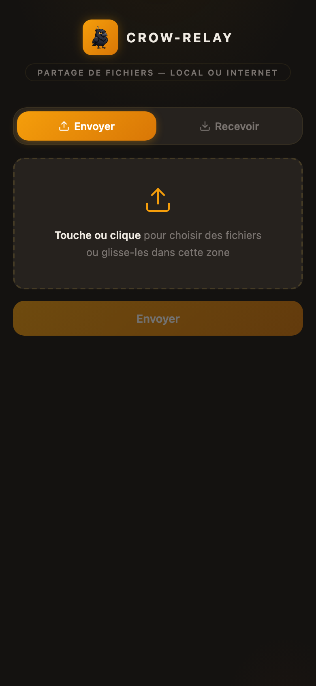
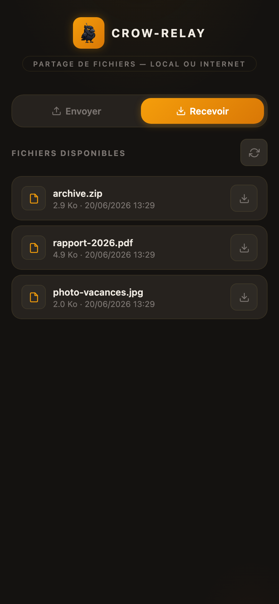
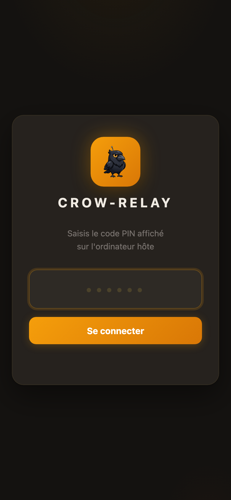
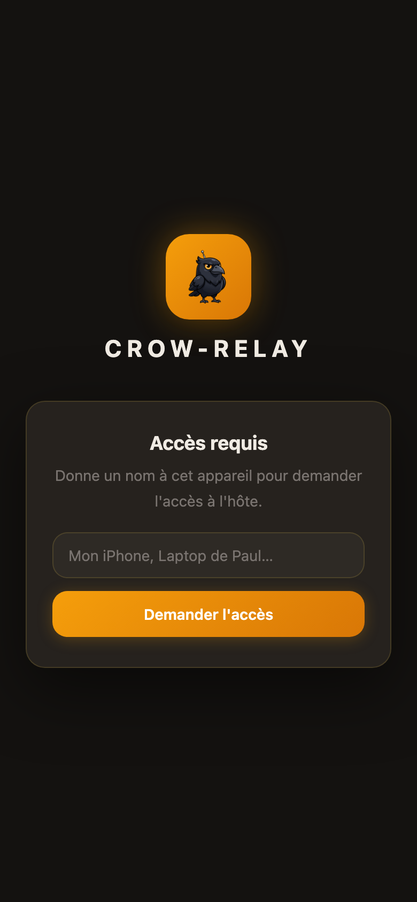
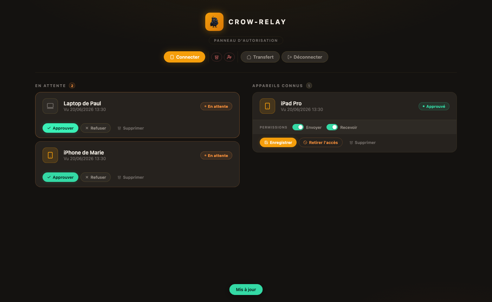

# Crow-Relay

**Crow-Relay** transforme ton ordinateur en point de dépôt partagé sur le réseau local. N'importe quel appareil — téléphone, tablette, autre PC — ouvre une **page web** pour **envoyer** ou **récupérer** des fichiers. Aucune application à installer, aucun câble, aucun cloud.

```
   Téléphone (navigateur)           Ordinateur (service Crow-Relay)
   ──────────────────────          ──────────────────────────
   http://<ip-du-pc>:8000  ──────▶  Flask + dossier "shared/"
        Envoyer  ─────────────────▶  fichier stocké sur le PC
        Recevoir ◀─────────────────  fichier téléchargé depuis le PC
```

Deux modes de connexion :
- **Réseau local** : PC et téléphone sur le même Wi-Fi — connexion directe via l'adresse locale.
- **Internet (tunnel)** : PC et téléphone sur des réseaux différents — via `--tunnel` (Cloudflare Tunnel, gratuit, sans compte).

> **Usage prévu** : outil de partage personnel/LAN, pas un service public à grande échelle.

---

## Aperçu

<p align="center">
  
  &nbsp;
  
  &nbsp;
  
  &nbsp;
  
</p>

<p align="center"><em>Côté téléphone : envoyer, recevoir, connexion par PIN, et demande d'autorisation.</em></p>

<p align="center">
  
</p>

<p align="center"><em>Côté hôte : le panneau d'autorisation où chaque appareil est approuvé.</em></p>

---

## Démarrage rapide

### Étape 1 — Télécharger

```bash
git clone https://github.com/ANESC0/Crow-Relay.git
cd Crow-Relay
```

ou télécharger l'[archive ZIP](https://github.com/ANESC0/Crow-Relay/archive/refs/heads/main.zip) et l'extraire.

### Étape 2 — Installer (une seule fois)

| Plateforme | Commande |
|---|---|
| **Windows** | Double-cliquer sur `scripts\setup.bat` |
| **macOS** | `bash scripts/setup.sh` dans un terminal |
| **Linux** | `bash scripts/setup.sh` dans un terminal |

Le script installe les dépendances et **crée un raccourci sur le bureau**.

> Nécessite **Python 3.10+** — [télécharger](https://www.python.org/downloads/) si besoin.  
> Sous Windows, cocher **"Add Python to PATH"** pendant l'installation.

### Étape 3 — Lancer

Double-cliquer sur le raccourci **Crow-Relay** créé sur le bureau.

Ou depuis un terminal :

| Plateforme | Commande |
|---|---|
| **Windows** | `scripts\crow-relay.bat` |
| **macOS** | `bash scripts/crow-relay.command` |
| **Linux** | `bash scripts/crow-relay.sh` |

---

## Options de lancement

```bash
# macOS / Linux
python3 app.py --port 9000        # changer le port (défaut : 8000)
python3 app.py --host 0.0.0.0     # changer l'interface d'écoute (défaut : toutes les cartes)
python3 app.py --host 192.168.1.50  # n'écouter/annoncer que cette carte (ex. Ethernet)
python3 app.py --pick-host        # si plusieurs cartes : demande sur laquelle écouter
python3 app.py --no-pin           # désactiver le code PIN (réseau de confiance)
python3 app.py --no-approval      # désactiver l'autorisation par appareil
python3 app.py --https            # chiffrer les transferts (certificat auto-signé)
python3 app.py --cert cert.pem --key key.pem  # utiliser son propre certificat TLS
python3 app.py --pin 1234         # imposer un code PIN fixe
python3 app.py --admin-key secret # imposer la clé du panneau d'autorisation
python3 app.py --tunnel           # exposer via Cloudflare Tunnel (internet)
python3 app.py --tunnel --tunnel-ttl 30  # fermer le tunnel après 30 min (par défaut : aucune expiration)
python3 app.py --max-mb 2000      # limiter les envois à 2 Go (défaut : illimité en LAN, 500 Mo en tunnel)
python3 app.py --no-open          # ne pas ouvrir le navigateur automatiquement
python3 app.py --no-qr            # ne pas afficher le QR code dans le terminal

# Windows : remplacer python3 par python
```

Variables d'environnement :

| Variable         | Rôle                                          | Défaut     |
| ---------------- | --------------------------------------------- | ---------- |
| `CROW_RELAY_PIN`       | Code PIN d'accès                              | généré     |
| `CROW_RELAY_ADMIN_KEY` | Clé du panneau d'autorisation                 | générée    |
| `CROW_RELAY_SHARE_DIR` | Dossier où sont stockés les fichiers          | `<dossier app>/shared` |
| `CROW_RELAY_MAX_MB`    | Taille max d'un envoi en Mo (vide = illimité) | illimité              |
| `CROW_RELAY_DEVICES_FILE` | Chemin du fichier de registre des appareils (vidé à chaque lancement) | `<dossier app>/devices.json` |

---

## Fonctionnement

### Connexion depuis le téléphone

Au démarrage, l'ordinateur affiche une adresse et un QR code. Deux façons de se connecter :

1. **Scanner le QR code** avec l'appareil photo → s'ouvre et se connecte automatiquement (le PIN est embarqué).
2. **Taper l'adresse** dans le navigateur (`http://192.168.x.x:8000`) puis saisir le code PIN.

Le navigateur s'ouvre aussi automatiquement sur l'ordinateur hôte.

**Plusieurs cartes réseau (Ethernet + Wi-Fi, VPN…)** : par défaut Crow-Relay écoute sur toutes les cartes et **détecte automatiquement l'adresse à annoncer** — en évitant les IP de VPN. Si l'hôte a plusieurs réseaux locaux, toutes les adresses détectées sont **listées dans le terminal et dans « Connecter un appareil »** : donne au téléphone celle qui correspond à son réseau. Si l'IP change (DHCP, changement de réseau), un **rechargement de page suffit** — pas besoin de relancer le service.

En mode local, **le lanceur demande sur quelle carte écouter** dès que plusieurs sont détectées (sinon il ne pose pas la question). Pour forcer une carte précise en ligne de commande : `--host <IP de la carte>` (n'écoute alors que sur ce réseau), ou `--pick-host` pour le menu interactif.

### Autorisation par appareil

Chaque appareil qui se connecte doit être **autorisé par l'hôte** avant de pouvoir échanger des fichiers :

1. L'appareil se connecte → écran **"Accès requis"**, il saisit un nom et envoie une demande.
2. L'hôte ouvre le **panneau d'autorisation** (s'ouvre automatiquement dans le navigateur).
3. L'hôte accorde le droit d'**envoyer** et/ou de **recevoir** pour chaque appareil — **les deux permissions sont désactivées par défaut**, l'hôte les active manuellement.
4. L'appareil se débloque automatiquement.

La liste des appareils est **réinitialisée à chaque lancement** — tous les appareils doivent être approuvés à nouveau à chaque session.

**Pré-remplissage du nom par adresse MAC (LAN uniquement)** : si un appareil déjà approuvé vide ses cookies, son nom est pré-rempli automatiquement grâce à son adresse MAC — mais l'hôte doit quand même approuver à nouveau l'appareil.

**Appareil refusé** : un appareil refusé peut cliquer "Redemander l'accès" pour repasser en file d'attente.

Pour désactiver l'autorisation par appareil : `--no-approval`.

### HTTPS

```bash
python3 app.py --https
```

Génère un certificat auto-signé (valide 397 jours, renouvelé automatiquement si l'IP change). Le navigateur affiche un avertissement à accepter une fois.

### Tunnel (accès depuis internet)

```bash
python3 app.py --tunnel
```

Expose le service via **Cloudflare Tunnel** : une URL publique temporaire est générée et affichée dans le terminal. Utile quand le téléphone et le PC ne sont pas sur le même réseau.

**Prérequis** : installer `cloudflared` sur le PC hôte (une seule fois).

```bash
# Windows (PowerShell)
winget install --id Cloudflare.cloudflared

# macOS
brew install cloudflared

# Linux
curl -L https://github.com/cloudflare/cloudflared/releases/latest/download/cloudflared-linux-amd64 -o cloudflared
chmod +x cloudflared && sudo mv cloudflared /usr/local/bin/
```

> **Windows** : le `.exe` téléchargeable sur GitHub est l'outil lui-même, pas un installeur. Passer par `winget` est plus simple. Voir le [guide d'installation](INSTALL.md#mode-tunnel--installer-cloudflared) pour l'installation manuelle.

Aucun compte Cloudflare requis. L'URL change à chaque lancement et n'expire pas par défaut (configurable avec `--tunnel-ttl`).

En mode tunnel, `--no-pin` et `--no-approval` sont refusés au démarrage — le PIN et l'autorisation par appareil sont obligatoires.

---

## Sécurité

- **Code PIN** aléatoire à chaque lancement (comparé en temps constant).
- **Autorisation par appareil** : chaque nouvel appareil doit être validé par l'hôte.
- **Clé de session** régénérée à chaque lancement.
- **Protection brute-force** : une IP est bloquée 10 minutes après 5 tentatives de PIN échouées.
- En mode tunnel, le PIN et l'autorisation par appareil sont **obligatoires** et non contournables.

> **Note** : Crow-Relay est servi par **cheroot** (serveur WSGI de production, 8 threads), pas le serveur de développement de Flask.

---

## Données & vie privée

Crow-Relay est un outil auto-hébergé : **aucune donnée ne transite par un serveur tiers**. En mode `--tunnel`, le trafic passe par l'infrastructure Cloudflare (voir [politique de Cloudflare](https://www.cloudflare.com/privacypolicy/)).

**Cookies posés par l'application :**

| Cookie | Durée | But |
|---|---|---|
| `crow_relay_device` | 1 an | Identifiant persistant de l'appareil pour le système d'autorisation |
| Session Flask (sans nom fixe) | Durée de session | Authentification PIN et session admin |

Ces cookies sont **strictement nécessaires** au fonctionnement de l'autorisation par appareil — aucun cookie de tracking ou publicitaire n'est utilisé.

**Données stockées localement sur l'hôte** (fichier `devices.json`) :
- Identifiant UUID de chaque appareil connecté
- Nom donné par l'utilisateur
- Date de première et dernière connexion
- En mode LAN : adresse MAC de l'appareil (utilisée pour la reconnaissance automatique si les cookies sont effacés)

Ces données ne quittent jamais l'ordinateur hôte. L'hôte qui déploie Crow-Relay est responsable du traitement de ces données vis-à-vis des appareils qui se connectent.

**Usage acceptable :** Crow-Relay est conçu pour un usage personnel ou en équipe restreinte sur un réseau de confiance. L'auteur décline toute responsabilité quant au contenu des fichiers partagés via l'application.

---

> Guide d'installation détaillé (pare-feu, dépannage) : [INSTALL.md](INSTALL.md)
